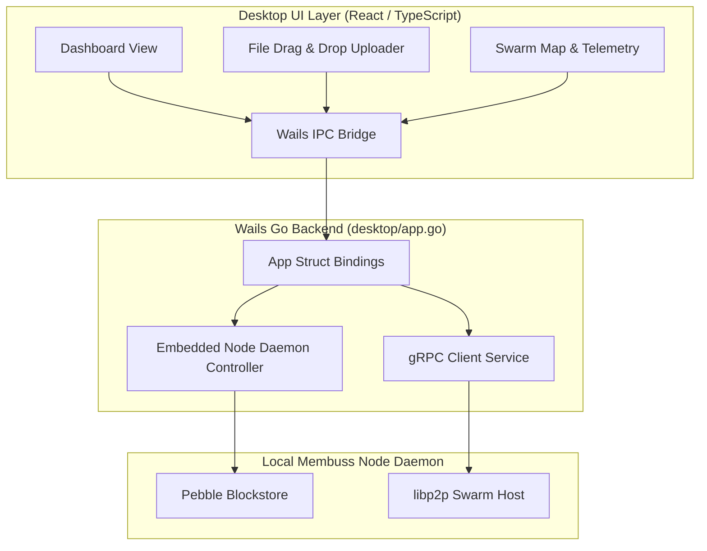

# Membuss Desktop GUI Application

The **Membuss Desktop Application** (`desktop/`) is a cross-platform graphical node manager and content client built using **Wails v2** (Go + React / TypeScript).

---

## 1. Desktop App Architecture



---

## 2. Core Features & Capabilities

- **Graphical Node Controller**: Start, stop, and configure local daemon listening ports and storage directories without terminal commands.
- **Drag-and-Drop Uploader**: Drop files or entire directory trees onto the application window for parallel BLAKE3 Merkle tree ingestion.
- **Content Explorer**: Browse stored MIDs, copy CIDv1 links, inspect raw DAG nodes, and toggle content sealing.
- **Live Swarm Telemetry**: View active libp2p peer connections, peer geographic distribution, and real-time Memex bandwidth graphs.
- **System Tray Integration**: Native system tray minimization with background seeding and auto-mirroring.

---

## 3. Building Desktop App from Source

### Requirements
- **Go**: 1.25+
- **Node.js**: 18+ (`npm` or `pnpm`)
- **Wails CLI**: `go install github.com/wailsapp/wails/v2/cmd/wails@latest`

### Build Steps

```bash
# Navigate to desktop directory
cd desktop

# Launch live development server with hot-reload
wails dev

# Build production executable for host OS
wails build
# Output executable: ./desktop/build/bin/membuss-desktop
```
