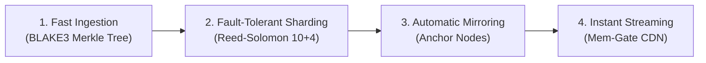

# Membuss Protocol Thesis & Vision

**Membuss** is a decentralized, content-addressed storage and streaming network built to solve the **data availability crisis** in peer-to-peer systems.

By combining **BLAKE3 parallel Merkle DAGs**, **Reed-Solomon 10+4 erasure coding**, **Pebble DB hybrid storage**, and **Anchor auto-mirroring**, Membuss guarantees that data remains online, fast, and accessible even when original seeders go offline.

---

## 1. Executive Summary & Vision

### The Problem
Traditional decentralized storage networks suffer from a fatal flaw: **data availability is fragile**.
- **IPFS**: Files vanish as soon as origin nodes stop pinning CIDs.
- **BitTorrent**: Torrents die when the last seeder disconnects.
- **Arweave / Filecoin**: High cost, slow read latency, and complex blockchain consensus overheads for simple file streaming.

### The Membuss Vision
Membuss turns decentralized storage into a **high-speed, self-healing content delivery network (CDN)**:
- **Zero Data Loss Guarantee**: Every payload is sharded into 10 data + 4 parity pieces. Any 4 nodes can fail without content corruption.
- **Instant First-Byte Streaming**: High-throughput `io.Reader` streaming over multiplexed libp2p streams (`Memex v2`).
- **50x–100x Ingestion Boost**: Small/medium blocks (< 1 MiB) are written directly into Pebble DB SSTables, avoiding filesystem inode creation overhead.

---

## 2. Competitive Landscape Comparison

| Feature | Membuss Protocol | IPFS (Kubo) | BitTorrent | Arweave / Filecoin |
|---|---|---|---|---|
| **Primary Focus** | **High-speed CDN & Permanent Storage** | General Content Addressing | Peer-to-Peer File Sharing | On-Chain Perpetual Storage |
| **Data Redundancy** | **Reed-Solomon 10+4** (Storage layer) | None (Raw blocks) | Optional Parity Files | Blockchain Proof-of-Access |
| **Data Permanence** | **Anchor Auto-Mirroring** | Manual Pinning | Active Seeder Uptime | Paid Storage Endowment |
| **Read/Streaming Latency**| **Instant HTTP Range Streaming** | High Bitswap Latency | Piece Assembly Delay | High Retrieval Latency |
| **Multihash Standard** | **BLAKE3 (`0x1e`)** | SHA2-256 (`0x12`) | SHA-1 / SHA-256 | Custom Hashing |
| **Database Engine** | **Pebble DB (LSM)** | Flatfs / BadgerDB | Flat Files | Proprietary Indexers |
| **Memory Deletions** | **O(1) Counting Bloom Filter** | Full Sweep Scans | Manual File Deletes | Permanent (No Deletes) |

---

## 3. Core Architectural Breakthroughs

### ⚡ 1. Parallel BLAKE3 Merkle Tree Construction
Instead of sequential single-threaded chunking, Membuss utilizes a multi-goroutine worker pool (`BuildParallel`). Files are chunked at 256 KiB boundaries and hashed using **BLAKE3 (`0x1e`)**, utilizing modern AVX-512 / NEON CPU vector extensions.

### 🛡️ 2. Storage-Layer Erasure Coding (10 Data + 4 Parity)
Payables are automatically split into 10 data shards and 4 parity shards via SIMD Galois Field GF(2^8) matrix arithmetic. Even if 40% of storing peers go offline simultaneously, content can be reconstructed instantly on the fly.

### 💾 3. Pebble DB Hybrid SSTable Storage
Pebble DB LSM engine stores small/medium blocks (< 1 MiB) directly in key-value SSTables. Large blobs (>= 1 MiB) are offloaded to flat files, eliminating OS inode exhaustion and enabling 50x–100x faster ingestion throughput.

### 🌐 4. Memex v2 Multiplexed Block Exchange
Operating on `/membuss/memex/2.0.0`, Memex maintains multiplexed libp2p stream sessions with AIMD sliding window flow control, peer latency ranking, and zero-copy byte streaming.

---

## 4. Future Possibilities & Protocol Ecosystem

The Membuss architecture provides a foundation for next-generation decentralized applications:

- **Decentralized Media & Video CDN**: Instant HTTP range requests (`Mem-Gate`) allow seamless 4K video streaming directly from peer networks.
- **Distributed Version Control (Mem-Git)**: Content-addressed Merkle DAGs natively support Git-like snapshotting, branching, and diff tracking.
- **Cryptographic Mutable Pointers (MemNS)**: Ed25519 signed pointers enable IPNS-style dynamic updates without changing root content MIDs.
- **AI Model Weights & Dataset Delivery**: Multi-gigabyte LLM weights and dataset shards can be sharded and fetched across hundreds of nodes at wire speed.
