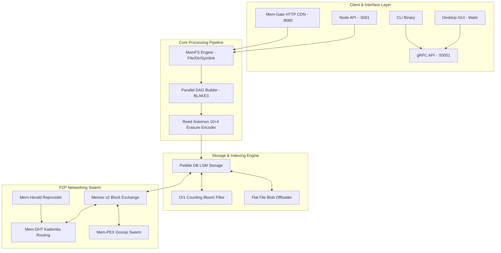
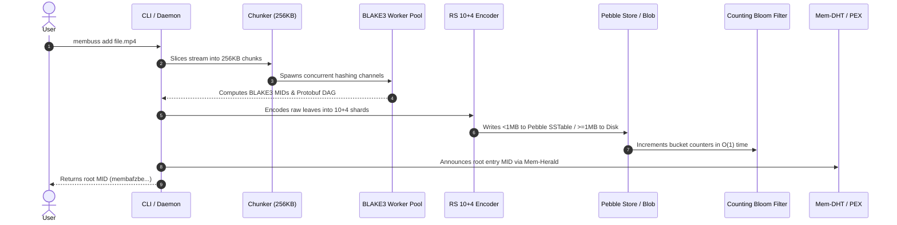
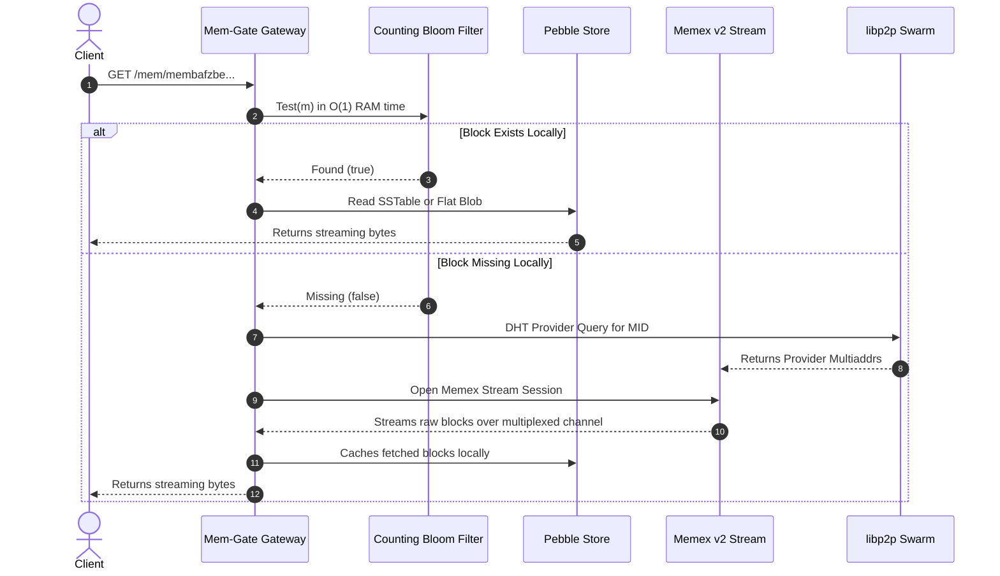

# System Architecture & Data Flow Blueprint

The **Membuss** architecture is structured into modular, decoupled layers for networking, storage, content processing, and API interfaces.

---

## 1. System Architecture Diagram

---

## 2. Ingestion & Storage Sequence

---

## 3. Retrieval & Remote Fetch Flow

