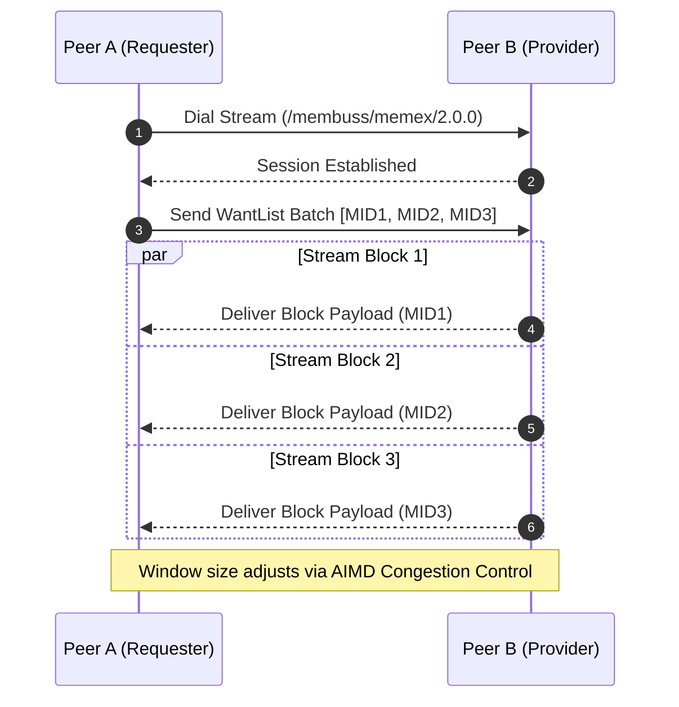

# Memex v2 Block Exchange Protocol

**Memex** is Membuss's custom block transfer protocol operating over libp2p stream multiplexing (Protocol ID: `/membuss/memex/2.0.0`).

---

## 1. Multiplexed Session Flow Diagram

---

## 2. AIMD Congestion Control & Peer Ranking

- **AIMD Flow Control**: Uses Additive Increase / Multiplicative Decrease window scaling to dynamically adjust block request batch sizes based on measured round-trip time (RTT).
- **Peer Ranking**: Peers are continuously ranked using an Exponential Moving Average (EMA) of latency and throughput ($B/s$).
