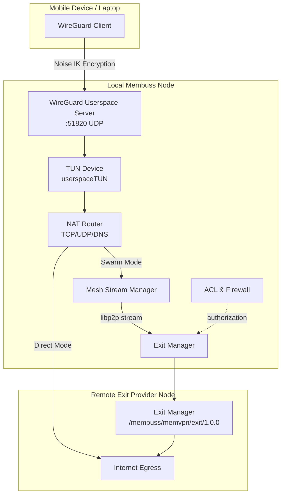
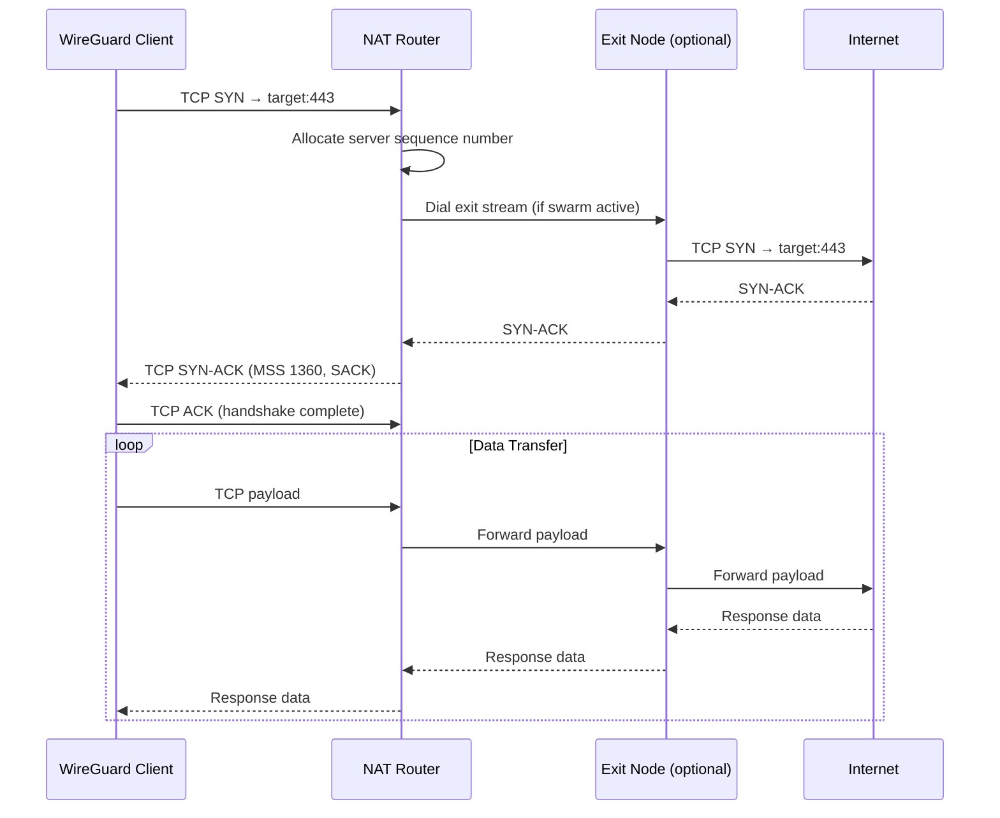
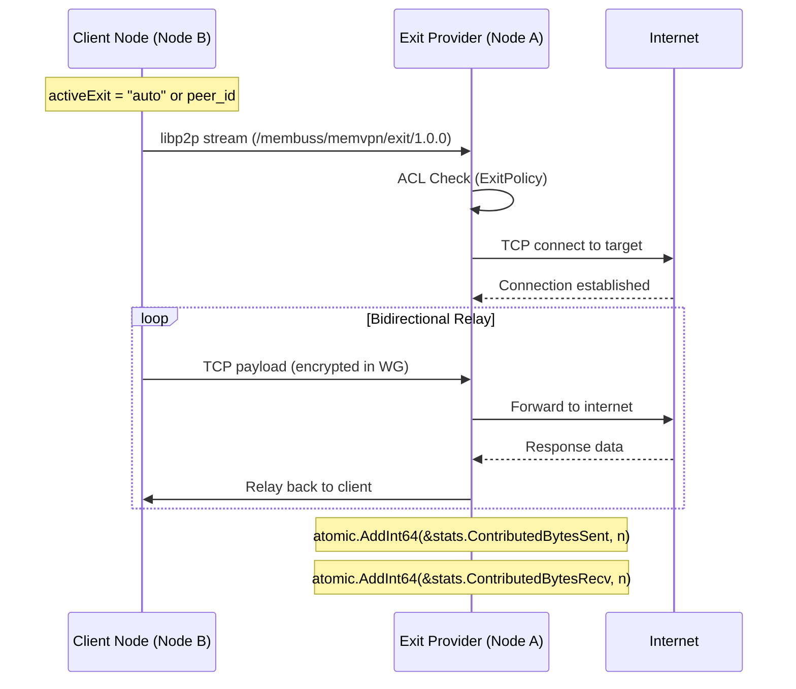

# MemVPN Protocol & Architecture

**MemVPN** is Membuss's integrated decentralized VPN subsystem — a pure-Go userspace WireGuard mesh overlay with a built-in P2P exit swarm for censorship-resistant internet access. It enables any Membuss node to act as a WireGuard VPN server for local devices while routing traffic either directly to the internet or through a decentralized network of exit provider nodes.

---

## 1. Architecture Overview



### 1.1 Component Inventory

| Component | File | Responsibility |
|---|---|---|
| `Service` | `memvpn.go` | Top-level orchestrator; owns all subsystems |
| `WGServer` | `wg_server.go` | Userspace WireGuard engine (wireguard-go) |
| `userspaceTUN` | `wg_server.go` | In-memory TUN device intercepting decrypted IP packets |
| `NATRouter` | `nat_router.go` | Userspace TCP/UDP/DNS packet routing & session management |
| `Mesh` | `mesh.go` | libp2p mesh peer discovery & heartbeat |
| `Router` | `router.go` | Virtual IP routing table |
| `ExitManager` | `exit_node.go` | Exit node stream handler & relay |
| `ACL` | `acl.go` | Peer authorization & exit policy enforcement |
| `ClientPeer` | `wg_server.go` | Per-device WireGuard state & UAPI telemetry |

---

## 2. WireGuard Userspace Engine

### 2.1 How It Works

MemVPN uses `golang.zx2c4.com/wireguard` in full userspace mode. No kernel module is required on any platform. The architecture:

1. **userspaceTUN** — A Go channel-backed `tun.Device` implementation. Decrypted IP packets from WireGuard clients land in `outboundCh`, and outbound packets are injected via `inboundCh`.
2. **wireguard-go Device** — The standard WireGuard engine handles Noise IK handshake, encryption, and decryption. It reads/writes through the TUN device.
3. **conn.Bind** — Default UDP bind listens on port `51820` (configurable via `wg_listen_port`).

### 2.2 Deterministic Port Binding

On startup, the WireGuard server attempts to bind the configured port (default `51820`) with an 8-attempt retry loop at 300ms intervals. This prevents port drift during rapid daemon restarts when the OS socket is still in `TIME_WAIT`. Only if the port is persistently claimed by an external process does it fall back to port `51821`–`51825`.

### 2.3 Persistent State

Server keys and device profiles are persisted to disk at `<data_dir>/memvpn/wg_state.json`:

```json
{
  "server_private_key": "base64-encoded-key",
  "server_listen_port": 51820,
  "devices": [
    {
      "id": "dev-1234567890",
      "name": "iPhone",
      "public_key": "base64...",
      "private_key": "base64...",
      "virtual_ip": "10.42.0.2",
      "allowed_ips": "10.42.0.2/32"
    }
  ]
}
```

On restart, existing keys and devices are restored automatically. Client phones reconnect without re-scanning QR codes.

### 2.4 Live UAPI Telemetry

`ListDevices()` calls `device.IpcGetOperation()` to extract real-time data directly from the WireGuard engine:

| Field | Source | Description |
|---|---|---|
| `last_handshake_time_sec` | UAPI | Used to determine `Connected` status (within 3 minutes) |
| `rx_bytes` / `tx_bytes` | UAPI | Wire-level byte counters |
| `endpoint` | UAPI | Client's current UDP endpoint |

---

## 3. NAT Router — Userspace Packet Processing

The NAT Router intercepts decrypted IP packets from the WireGuard TUN and routes them. It handles three protocols:

### 3.1 DNS Resolution (UDP port 53)

When a client device makes a DNS query:

1. The NAT Router intercepts the UDP packet destined for port 53
2. Races the query against **3 upstream resolvers concurrently**:
   - `1.1.1.1:53` (Cloudflare)
   - `8.8.8.8:8` (Google)
   - `9.9.9.9:53` (Quad9)
3. Returns the first successful response to the client
4. Tracks `DNSQueriesCount` in telemetry

This provides fast, resilient, anti-leak DNS resolution. All DNS traffic stays within the encrypted tunnel.

### 3.2 TCP Handling (HTTP/HTTPS)

TCP connections follow a full userspace TCP stack:



**Key implementation details:**

- **SYN-ACK construction**: `buildIPv4TCPSynAckPacket` builds a valid TCP SYN-ACK with MSS 1360 and SACK Permitted options
- **Session management**: Each TCP flow is tracked in `tcpSessions` map keyed by `srcIP:srcPort:dstIP:dstPort`
- **Sequence tracking**: Server maintains independent sequence numbers per session
- **Checksums**: Proper IP header checksums and TCP checksums (with pseudo-header) are computed

### 3.3 UDP Handling

For non-DNS UDP traffic:

- **Without exit node**: UDP packets are dialed directly via `net.DialUDP` to the target
- **With exit node active**: UDP port 443 (QUIC/HTTP3) packets are **dropped**, forcing browsers to fall back to TCP (HTTP/2/HTTPS) through the exit swarm tunnel

This ensures that high-bandwidth streaming protocols (YouTube, TikTok, Netflix) route through the exit node rather than bypassing it via QUIC.

---

## 4. Decentralized Exit Swarm

### 4.1 Operating Modes

| Mode | `selected_exit` | Behavior |
|---|---|---|
| **Direct Egress** | `""` (empty) | Traffic routes directly from the local node to the internet |
| **Auto Swarm** | `"auto"` | Auto-discovers the best exit provider in the mesh |
| **Explicit Exit** | peer ID | Routes through a specific exit provider node |

### 4.2 Exit Provider Protocol

When a client node selects an exit provider:

1. **Stream Dial**: Client opens a libp2p stream using protocol ID `/membuss/memvpn/exit/1.0.0`
2. **Authorization**: Provider's ACL checks if the requesting peer is authorized (via `ExitPolicy`)
3. **TCP Relay**: Provider dials the target internet server and pipes data bidirectionally
4. **Contribution Tracking**: Provider increments `ContributedBytesSent`, `ContributedBytesRecv`, and `ContributedConns`



### 4.3 Exit Policy & Authorization

The `ExitPolicy` controls which peers can relay traffic through an exit node:

```go
type ExitPolicy struct {
    AllowAll        bool     // Allow all peers (open relay)
    AllowedPeers    []string // Whitelist of specific peer IDs
    BlockPrivateIPs bool     // Block RFC1918 destinations (always true)
}
```

- When "Act as Exit Node Provider" is enabled via the Web UI, `AllowAll` defaults to `true`
- Private IP ranges (`10.0.0.0/8`, `172.16.0.0/12`, `192.168.0.0/16`, `127.0.0.0/8`) are **always blocked** to protect local networks

### 4.4 Swarm Contribution Telemetry

The exit provider tracks real-time contribution metrics:

| Metric | Atomic Counter | Description |
|---|---|---|
| `ContributedBytesSent` | `int64` | Total bytes relayed to internet on behalf of peers |
| `ContributedBytesRecv` | `int64` | Total bytes received from internet and sent to peers |
| `ContributedConns` | `int64` | Number of relay sessions served |
| `ContributionRatio` | `float64` | Ratio of contributed bytes to consumed bytes |

---

## 5. Traffic Statistics & Live Throughput

### 5.1 Telemetry Categories

The `TrafficStats` struct tracks three categories:

1. **Aggregate Wire Traffic** (`BytesSent`, `BytesRecv`) — Raw WireGuard packet counters
2. **Client Device Traffic** (`ClientBytesSent`, `ClientBytesRecv`) — Traffic consumed by local paired devices
3. **Swarm Contribution** (`ContributedBytesSent`, `ContributedBytesRecv`) — Traffic relayed for other nodes

### 5.2 Live Speed Calculation

A background goroutine (`rateTrackerLoop`) computes real-time upload/download speeds every second:

```
currentTotal = ClientBytes + ContributedBytes + RawBytes
dt = now - lastRateTime
speed = (currentTotal - lastTotal) / dt
```

The result is stored in `CurrentUploadBps` and `CurrentDownloadBps` and exposed via the API and Web Explorer.

### 5.3 Protocol Inspector

The NAT router tracks per-protocol counters:

- `DNSQueriesCount` — Anti-leak DNS queries resolved
- `TCPConnsCount` — Active TCP connections
- `UDPFlowsCount` — Active UDP datagram flows

---

## 6. Client Device Management

### 6.1 Device Lifecycle

```
AddDevice(name) → GenerateCurve25519Keypair → AssignVirtualIP → PersistToDisk → ReturnWGProfile
```

Each device receives:
- A unique Curve25519 keypair (client private/public key)
- A virtual IP from the `10.42.0.x` subnet
- A complete WireGuard configuration profile

### 6.2 QR Code & Config Profile

The `WGProfile` contains everything needed for a WireGuard client:

```
[Interface]
PrivateKey = <client-private-key>
Address = <virtual-ip>/32
DNS = 1.1.1.1, 8.8.8.8

[Peer]
PublicKey = <server-public-key>
Endpoint = <host-ip>:51820
AllowedIPs = 0.0.0.0/0, ::/0
PersistentKeepalive = 15
```

- `PersistentKeepalive = 15` ensures instant handshake on tunnel activation
- `AllowedIPs = 0.0.0.0/0` routes all traffic through the tunnel (no leaks)
- DNS is hardcoded to `1.1.1.1, 8.8.8.8` and resolved within the tunnel

### 6.3 State Persistence

Device profiles are saved to `<data_dir>/memvpn/wg_state.json`. On daemon restart:
1. Server private key is restored (same public key)
2. All device profiles are restored
3. Client phones reconnect automatically without re-importing configs

---

## 7. Mesh Peer Discovery

### 7.1 Mesh Protocol

MemVPN uses libp2p stream multiplexing with protocol ID `/membuss/memvpn/1.0.0` for mesh communication. Peers are discovered through:

1. **libp2p DHT** — Kademlia-based distributed hash table
2. **PEX (Peer Exchange)** — Gossip protocol for peer announcements
3. **Bootnodes** — Initial bootstrap peer list

### 7.2 Heartbeat & Status

Each node periodically broadcasts its status to mesh peers:
- Virtual IP
- Exit node capability (`is_exit_node`)
- Connected device count
- Exposed services list

---

## 8. P2P Service Mesh

### 8.1 Exposed Services

Local TCP services can be exposed to the mesh:

```bash
# Via API
POST /api/v1/vpn/services/expose
{
  "name": "webapp",
  "target_addr": "127.0.0.1:3000",
  "description": "Local web dashboard"
}
```

Other mesh peers can connect to exposed services by name.

### 8.2 Port Forwarding

Remote services can be forwarded to a local listening port:

```bash
POST /api/v1/vpn/services/forward
{
  "local_addr": "127.0.0.1:8888",
  "remote_peer_id": "12D3KooW...",
  "remote_service": "webapp"
}
```

This creates a local TCP listener on `127.0.0.1:8888` that tunnels to the remote peer's exposed service.

---

## 9. Web Explorer Dashboard

The Web Explorer at `/vpn` provides real-time telemetry:

### 9.1 Telemetry Cards

| Card | Metrics |
|---|---|
| **Swarm Contribution** | Total contributed bytes, upload/download breakdown, relay request count, contribution ratio |
| **Client Devices** | Paired device count, total client bandwidth, active flows |
| **Live Throughput** | Real-time download/upload speed (B/s, KB/s, MB/s, GB/s) |
| **Protocol Inspector** | DNS queries, TCP connections, UDP flows |

### 9.2 Device Management

- **QR Code Generation** — One-click WireGuard config QR code for mobile scanning
- **Config Download** — Download `.conf` file for desktop WireGuard clients
- **Add/Delete Devices** — Register new client profiles or remove existing ones
- **Endpoint Override** — Custom LAN IP for Wi-Fi clients

### 9.3 Exit Swarm Control

- **Enable/Disable Auto Swarm** — Toggle automatic exit node discovery
- **Select Specific Exit** — Choose a specific exit provider from the mesh
- **Exit Provider Toggle** — Act as an exit node for other mesh peers

---

## 10. Configuration

### 10.1 YAML Configuration

```yaml
memvpn:
  mesh_id: "my-mesh-network"
  node_name: "my-node"
  virtual_ip: "10.42.0.1"
  wg_listen_port: 51820
  is_exit_node: false
  selected_exit: ""          # "" = direct, "auto" = auto-discover, or peer ID
  exit_allow_all: true       # Allow all peers to relay through this node
  connect_timeout: 10s
  data_dir: "~/.memdata"
```

### 10.2 CLI Flags

```bash
membuss daemon \
  --config ./membuss.yaml \
  --datadir ~/.memdata \
  --gateway-addr 127.0.0.1:5001
```

---

## 11. REST API Endpoints

### 11.1 VPN Status

```
GET /api/v1/vpn/status
```

Returns `MeshStatus` JSON with full telemetry, peer list, exit nodes, services, and stats.

### 11.2 WireGuard Device Management

| Method | Endpoint | Description |
|---|---|---|
| `GET` | `/api/v1/vpn/wg/devices` | List all registered client devices |
| `POST` | `/api/v1/vpn/wg/device` | Register a new client device |
| `DELETE` | `/api/v1/vpn/wg/device?id=NAME` | Delete a client device |
| `GET` | `/api/v1/vpn/wg/profile?device=NAME` | Get WireGuard config profile |
| `GET` | `/api/v1/vpn/wg/config?device=NAME` | Download .conf file |

### 11.3 Exit Node Control

| Method | Endpoint | Body | Description |
|---|---|---|---|
| `POST` | `/api/v1/vpn/exit/select` | `{ "peer_id": "auto" or peer_id or "" }` | Select exit node |
| `POST` | `/api/v1/vpn/exit/toggle` | `{ "enabled": true, "allow_all": true }` | Toggle exit provider mode |

### 11.4 Service Mesh

| Method | Endpoint | Description |
|---|---|---|
| `POST` | `/api/v1/vpn/services/expose` | Expose a local service to the mesh |
| `DELETE` | `/api/v1/vpn/services/expose?name=NAME` | Unexpose a service |
| `POST` | `/api/v1/vpn/services/forward` | Forward to a remote peer's service |
| `DELETE` | `/api/v1/vpn/services/forward?local_addr=ADDR` | Stop port forwarding |

---

## 12. Security Properties

### 12.1 Encryption Layers

1. **WireGuard Layer** — Noise IK protocol with Curve25519 key exchange, ChaCha20-Poly1305 AEAD
2. **libp2p Layer** — TLS 1.3 or Noise protocol for inter-node communication
3. **End-to-End** — Traffic is encrypted from phone to exit node, then relayed to the internet

### 12.2 Anti-Leak Guarantees

- `AllowedIPs = 0.0.0.0/0` ensures all traffic enters the tunnel
- DNS queries are resolved through the tunnel (anti-leak DNS)
- Private IP ranges are blocked at exit nodes (RFC1918 firewall)
- No traffic bypasses the tunnel while VPN is active

### 12.3 State Persistence Security

- `wg_state.json` is written with `0600` permissions (owner-only read/write)
- Server private keys are never logged or exposed via API
- Device private keys are only included in config profiles (not in status responses)

---

## 13. Performance Characteristics

| Metric | Value |
|---|---|
| WireGuard handshake | under 15ms (Noise IK) |
| DNS resolution | Concurrent 3-resolver race, under 500ms |
| TCP handshake (local) | under 10ms |
| TCP handshake (swarm) | under 100ms (libp2p stream dial) |
| MTU | 1420 bytes (WireGuard default) |
| PersistentKeepalive | 15 seconds |
| UI poll interval | 1.5 seconds |
| Telemetry update | 1 second |

---

## 14. File Locations

| Path | Description |
|---|---|
| `core/memvpn/memvpn.go` | Service orchestrator |
| `core/memvpn/wg_server.go` | WireGuard engine + TUN |
| `core/memvpn/nat_router.go` | TCP/UDP/DNS packet routing |
| `core/memvpn/exit_node.go` | Exit node stream handler |
| `core/memvpn/mesh.go` | Mesh peer discovery |
| `core/memvpn/router.go` | Virtual IP routing |
| `core/memvpn/acl.go` | Authorization & firewall |
| `core/memvpn/types.go` | Shared type definitions |
| `core/memvpn/wg_keys.go` | Key generation & config formatting |
| `gateway/explorer/vpn_handlers.go` | Web Explorer API handlers |
| `explorer-web/src/routes/vpn/+page.svelte` | Web Explorer UI |
| `<data_dir>/memvpn/wg_state.json` | Persistent WireGuard state |
