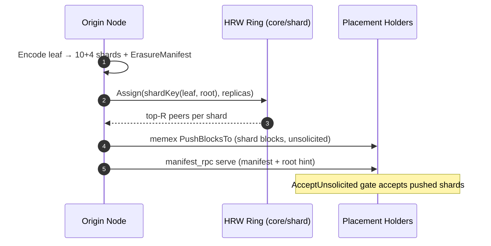

# Shard Placement & Remote Reconstruction

Membuss distributes erasure-coded shards across the network deterministically. Every sealed root's shards are placed on **HRW (rendezvous) hash-assigned peers**, and any node can reconstruct a block by gathering `K` of `N` shards from remote peers — without holding the original.



---

## 1. Placement Keys

Shards of one leaf are placed **as a unit** — the placement key is derived from the leaf MID plus its ingest root, not per-shard hashes:

```text
shardKey = SHA2-256("membuss/shardset/1" || root || leaf)
```

This keeps all `N` shards of a leaf on the same replica set (up to `shard_replicas`, default `3`), so a fetcher needs at most one holder set to reach `K` shards. The key is pinned to SHA-2 (not the mutable default hash) so nodes with different hash configs agree.

---

## 2. Ingest → Placement (opt-in)

With `shard_placement: true` in config, the Add path runs after seal:

1. **Link**: `erasure_root/<leaf> → root` rows are written for manifest-bearing leaves.
2. **Assign**: HRW ring assigns `shard_replicas` holders per leaf's shard set.
3. **Push**: shard blocks are streamed to holders via Memex `PushBlocksTo` (unsolicited push, gated server-side by the wantlist/accept policy).
4. **Announce**: holders provide the root under the shard-set namespace so fetchers can discover them via DHT.

Disabled (default), ingest keeps the pre-existing behavior: local seal + root-level DHT announcements only.

---

## 3. Manifest RPC (`/membuss/manifest/v1`)

A node that holds shards but not the original needs the `ErasureManifest` (`K`, `M`, `ShardMids`). The manifest RPC serves it peer-to-peer:

```text
Request : { mid }
Response: { manifest, root_mid? }
```

The server attaches its local `erasure_root` linkage row as a hint when present. A fetching node persists any manifest it learns, so subsequent Gets skip the round trip.

---

## 4. Remote k-of-n Gather

`fetchingBlockstore` resolves a miss in three steps:

1. **Direct fetch** of the block from DHT providers.
2. **Manifest lookup** — local metadata first, then manifest RPC against connected peers.
3. **Shard gather** — collect shards from holders (root-hint → `FindShardSets` DHT discovery, or connected peers), stopping as soon as `K = DataShards` valid shards arrive; reconstruct, verify BLAKE3 hash, cache.

---

## 5. Configuration

| Key | Default | Meaning |
|---|---|---|
| `shard_placement` | `false` | Enable push-based shard placement after ingest |
| `shard_replicas` | `3` | Replica count per shard set (1..64) |
